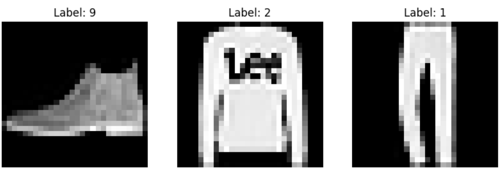
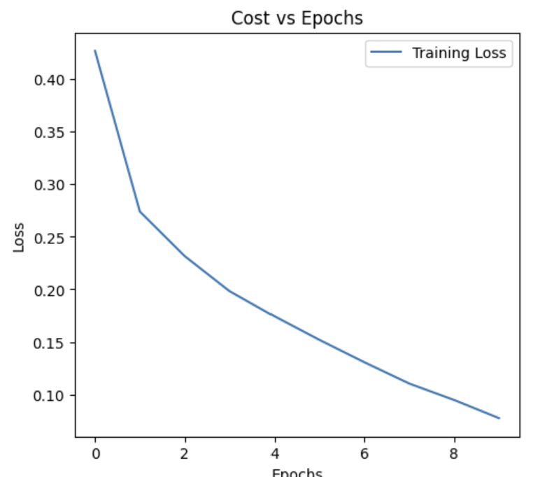
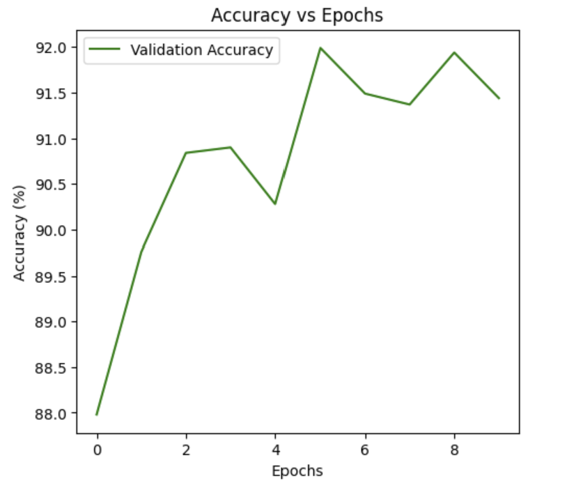

# Fashion MNIST Image Classification using CNN

This project implements a **Convolutional Neural Network (CNN)** in PyTorch to classify images from the **Fashion MNIST** dataset into one of 10 categories such as T-shirt, trousers, shoes, and more.

## 📌 Project Overview
- **Dataset:** Fashion MNIST (grayscale, 28x28 images, 10 classes)
- **Framework:** PyTorch
- **Goal:** Achieve ≥ 85% validation accuracy
- **Achieved:** ~92% validation accuracy

---

## 📂 Dataset
The Fashion MNIST dataset contains:
- **60,000 training images**
- **10,000 validation images**
- **10 classes**:  
  0 = T-shirt/top  
  1 = Trouser  
  2 = Pullover  
  3 = Dress  
  4 = Coat  
  5 = Sandal  
  6 = Shirt  
  7 = Sneaker  
  8 = Bag  
  9 = Ankle boot  

---

## 🖼 Sample Validation Images
Below are the **first three images** from the validation dataset:



---

## 🧠 Model Architecture
- **Conv2d(1, 32, kernel_size=3, padding=1)** → ReLU → MaxPool(2, 2)  
- **Conv2d(32, 64, kernel_size=3, padding=1)** → ReLU → MaxPool(2, 2)  
- **Flatten → Linear(64*7*7, 128) → ReLU → Linear(128, 10)**  

Optimizer: **Adam**  
Loss Function: **CrossEntropyLoss**  
Batch size: **64**  
Epochs: **10**  

---


## 📊 Training Results
During training, the **loss decreased steadily** and the **accuracy increased** above 85%, peaking around **92%**.

**Cost vs Epochs:**

**Accuracy vs Epochs:**

---

## 🚀 How to Run
1. Clone this repository:
```bash
git clone https://github.com/yourusername/fashion-mnist-cnn.git
cd fashion-mnist-cnn
